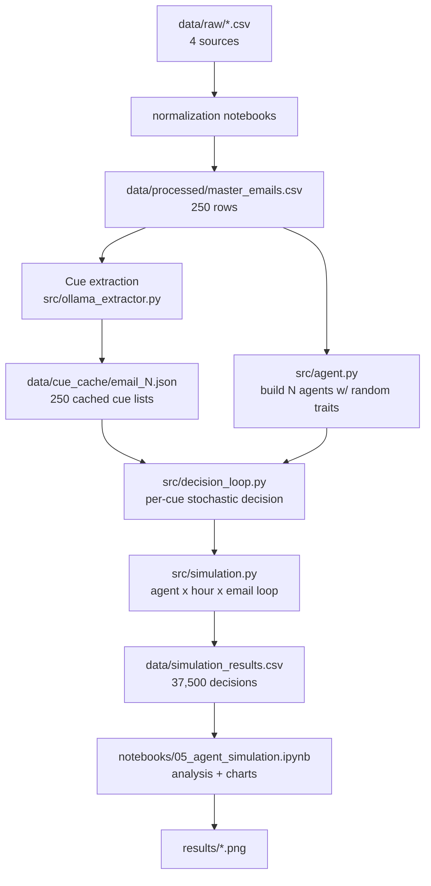

# Agent Simulation — Architecture & Working

> **Scope:** this documents the **v1 baseline** — the codebase as committed at `a50026a`
> ("Final touchups to the Demo materials"). That is what you get on a fresh clone, and it is
> what this map describes: 250 emails, `src/agent.py`, `notebooks/05_agent_simulation.ipynb`.
>
> A **v2 generation** (redesigned cognitive model + a 1,595-email multi-source corpus) also
> exists in `*_v2` files — see `README.md`. v1 is untouched by it and still runs standalone.
> Start here to understand the foundation; go to `README.md` / `SYSTEM.md` for v2.

**Project:** *AI Phishing Simulation via Hybrid Agent-Based Modeling* (PES University capstone, PW26_SVM_01).
It models **how an employee's cognitive state — fatigue, burnout, motivation — affects how often they fall for phishing**, and whether AI-generated phishing is harder to detect than real phishing. Real phishing tests on staff are unethical, so instead we run a stochastic simulation of synthetic employees reading a labelled email corpus.

---

## 1. The idea in one paragraph

We take **250 labelled emails** (benign + three flavours of phishing), use an **LLM to extract "phishing cues"** from each one, then generate a population of **synthetic employee "agents"** with randomised psychological/occupational traits. Each agent reads every email at several points across a simulated workday. Whether an agent **clicks** (falls for it) or **reports** (catches it) is decided by a stochastic loop driven by occupational-psychology equations for **fatigue → job performance → flawed perception**. The output is a big table of decisions we analyse for click rates by email type, time of day, and agent traits.

---

## 2. Pipeline (end to end)



**Where the entry point is:** open `notebooks/05_agent_simulation.ipynb` and run top to bottom. It imports from `src/`, runs the simulation (or loads cached results), and produces every chart. Ollama should be running (`ollama serve`); if it isn't, the cached cues still let it run.

---

## 3. Dataset

`data/processed/master_emails.csv` — the single source of truth, **250 rows, 7 columns**:

| Column | Meaning |
|---|---|
| `email_id` | 1–250 |
| `subject`, `sender`, `body` | email content (headers stripped) |
| `extracted_urls` | Python-list string of URLs found in the body |
| `source` | `spamassassin_ham` / `phishbowl` / `plain_llm` / `hybrid_vtriad` |
| `actual_class` | 0 = benign, 1 = phishing |

| Source | Count | Class | What it is |
|---|---|---|---|
| SpamAssassin Ham | 100 | benign | Real legitimate email (Apache SpamAssassin public corpus) |
| Phishbowl | 50 | phishing | Real phishing archived by Cornell University |
| Plain LLM | 50 | phishing | Naive AI-generated phishing (raw LLM output) |
| Hybrid V-Triad | 50 | phishing | AI phishing guided by the V-Triad persuasion framework |

Raw sources live in `data/raw/` (the synthetic ones were generated with GPT/Claude/Gemini — see `data/raw/llm_generations/*.json`). The idea is a **sophistication spectrum**: benign → real phishing → naive AI → guided AI.

---

## 4. Phishing cues

Before any agent reads an email we detect which of **9 cues** are present. Cues are the red flags an alert human would notice.

| Cue | Meaning |
|---|---|
| `urgency` | "act now", "expires today" |
| `threats` | "account suspended", "legal action" |
| `generic_greeting` | "Dear Customer" |
| `spelling_grammar` | obvious spelling/grammar errors |
| `emotional_appeal` | "congratulations", "you've been selected" |
| `too_good_true` | "you won", "free gift", lottery language |
| `personal_info` | asks for password / SSN / card number |
| `suspicious_sender` | spoofed or typosquatted sender domain |
| `suspicious_link` | URL shorteners, odd TLDs, brand-mismatch domains |

Cues are extracted **once** and cached to `data/cue_cache/email_{id}.json` (a JSON array of cue names). Cache-first: an existing file is reused; extraction only runs on a miss.

**Three extractors exist (same output schema):**
- `src/ollama_extractor.py` — **primary**. Local LLM via Ollama (`llama3.1:8b`). Understands tone/implication a regex can't. This is what notebook 05 uses (`USE_OLLAMA=True`).
- `src/cue_extractor.py` — Gemini `gemini-2.5-flash`. The original primary; **deprecated** because the free tier (20 req/day) kept returning empty. Kept as a fallback.
- `src/regex_extractor.py` — pure pattern matching, no API. Final fallback; less accurate on subtle phishing.

Average cues per email by source (informative — sophistication shows up here): plain_llm ≈ 4.8, phishbowl ≈ 3.4, hybrid_vtriad ≈ 2.4, ham ≈ 0.3.

---

## 5. The agent model — `src/agent.py`

Each agent is a dataclass with 20+ traits (demographics, sleep, psychological state, job characteristics) plus workday-dynamic state. Agents are generated with **seeded random traits** (`Agent.random_agent`) so runs are reproducible. All the psychology equations live here.

### 5.1 Fatigue (time-varying)

Three components combine into `TotalFatigue ∈ [1,5]`:

**(a) KSS — biological time-of-day fatigue** (Åkerstedt Three-Process Model):
```
S (homeostatic) = ha - (ha - S_w) * e^(d * hours_awake)     ha=14.3, d=-0.0353
C (circadian)   = 2.5 * cos(2π(hour - 16.8)/24)             peaks ~4:48 PM
KSS = 10.6 - 0.6 * (S + C)                                   1=alert … 9=sleepy
```

**(b) ED — energy depletion from job characteristics** (Tian et al. 2022):
```
ED = 0.65*job_complexity - 0.20*intrinsic_motivation + 1.80     clamp [1,5]
```

**(c) f_dynamic — situational depletion that accumulates over the day** (JD-R, Bakker & Demerouti 2007), updated in `advance_workday`:
```
depletion = 0.30*workload + 0.25*time_pressure + 0.20*ED + 0.10*workload*time_pressure   (normalised)
recovery  = 0.15*(1-workload)*(1-f_dynamic)
f_dynamic += (2/9) * (depletion - recovery)      clamp [0,1]
```

```
TotalFatigue = (KSS_norm + ED)/2 + f_dynamic     clamp [1,5]
```

### 5.2 Job performance (`compute_job_performance`)
Two regression equations averaged, then a fatigue penalty (Rehman 2015 + Basit & Hassan 2017):
```
JP1 = 2.766 - 0.106*burnout + 0.301*intrinsic_motivation + 0.298*job_satisfaction
             - 0.153*role_conflict - 0.076*leave_intention
JP2 = 3.238 - 0.022*time_pressure - 0.086*workload - 0.141*lack_motivation - 0.155*role_ambiguity
FinalJP = (JP1 + JP2)/2 - 0.34*TotalFatigue
```
`time_pressure` and `workload` ramp up across the day, so JP degrades as the workday advances.

### 5.3 Flawed Perception Level — FPL (`compute_flawed_perception_level`)
The probability an agent **fails to notice** a cue. Rises with fatigue, falls with job performance:
```
FPL = 0.5 * fatigue_norm * (1 - jp_norm)      range [0, 0.5]
```

### 5.4 Per-cue FPL (`get_cue_fpl`)
Base FPL is scaled by **cue strength** (obvious cues are hard to miss) and adjusted by traits:
```
cue_fpl = FPL * (1 - CueStrength[cue])
  + URL cues (suspicious_link/sender): penalty for older / less-educated agents
  - account-threat cues: bonus for desk workers in complex jobs (they see these often)
```
`CueStrength`: suspicious_link/sender = 0.8, personal_info/threats = 0.7, urgency/too_good_true = 0.6, emotional_appeal = 0.5, generic_greeting/spelling_grammar = 0.4. This is why V-Triad emails (few, subtle cues) get through more than plain-LLM (many, obvious cues).

### 5.5 Workday state (`advance_workday(hour)`)
Sets `current_hour`, ramps `time_pressure` (1→5) and `workload` (1.5→5) linearly across the day, and accumulates `f_dynamic`. Calling it makes all the above recompute for that hour.

---

## 6. The decision loop — `src/decision_loop.py`

For one `(agent, email, hour)`:
```
shuffle the email's cue list
for each cue (up to agent.max_cues_processed):
    if random() > agent.get_cue_fpl(cue):     # agent noticed it
        suspicion_counter += 1
    if suspicion_counter >= agent.suspicion_threshold:
        return "reported"                       # caught the phish
return "clicked"                                # fell for it
```
- `suspicion_threshold ∈ 2..6`, `max_cues_processed ∈ 7..12` (per-agent, fixed).
- **On a phishing email:** `clicked` = bad, `reported` = good. **On a benign email:** `clicked` = correct, `reported` = false positive.
- Randomness is seeded → fully reproducible.

---

## 7. Orchestration & scale — `src/simulation.py`

`run_simulation()` does: (1) extract/lookup cues for all 250 emails, (2) `build_agents(n, seed)`, (3) triple loop **agent × workday_hour × email** → one row per decision.

```
30 agents × 5 hours (8am,10am,12pm,2pm,4pm) × 250 emails = 37,500 decisions
```
Output: `data/simulation_results.csv` (one row per decision, with the agent traits, fatigue/JP/FPL, cues scanned/perceived, and the decision). The extractor class is injectable — notebook 05 sets it to `OllamaExtractor` before calling.

---

## 8. Notebooks

| Notebook | Purpose |
|---|---|
| `02_pattern_testing.ipynb` | develops & tests the 9 regex cue patterns (ported to `regex_extractor.py`) |
| `03_audit_synthetic_vs_real.ipynb` | quality audit: real vs AI phishing (Phishbowl 4.83 > V-Triad 2.50 > Plain 1.50 /5) |
| `04_agent_simulation.ipynb` | earlier, fuller simulation + analysis notebook |
| `05_agent_simulation.ipynb` | **current** clean run — TPM fatigue + JP regression + CueStrength FPL + f_dynamic |

(`01b_regenerate_synthetic_datasets.ipynb` regenerates the synthetic email CSVs.)

---

## 9. Results (from the committed `simulation_results.csv`)

**Phishing click rate** (higher = more agents fooled):

| Source | Click rate |
|---|---|
| hybrid_vtriad | **67.2%** |
| phishbowl | 51.6% |
| plain_llm | 32.7% |

Benign pass rate 98.7% (false-positive rate ≈ 1.3%).

**Headline finding:** hybrid V-Triad phishing fools the most agents *because it contains the fewest detectable cues* — guided-LLM emails read like legitimate corporate mail, while naive LLM output is full of obvious "act now / suspended" language that agents catch. Sophistication is inversely related to detectability.

*(Note: `README.md` quotes higher click numbers from an older run; the numbers above are what the committed results CSV actually contains.)*

---

## 10. How to run

```bash
python -m venv .venv && .venv\Scripts\activate        # Windows
pip install pandas numpy scikit-learn matplotlib seaborn jupyter ipykernel requests python-dotenv textblob
ollama serve            # and: ollama pull llama3.1:8b   (for fresh cue extraction)
jupyter notebook notebooks/05_agent_simulation.ipynb
```
- Cell has `RERUN=True` to re-simulate, or `False` to load `simulation_results.csv`.
- To re-extract cues from scratch: delete `data/cue_cache/` and re-run.
- `.env` holds `GEMINI_KEY` (only needed if you use the Gemini extractor).

---

## 11. Known limitations / good first issues

These are documented characteristics of the current build — natural places to contribute:

- **Cue quality gap:** 78 of 250 cue files are empty (mostly ham, but a few phishing too). An email with 0 cues is *always* clicked, which caps how much the cognitive model can move outcomes. Re-running Ollama extraction on the empties helps.
- **Suspicion-threshold dominance:** click rate is driven far more by the fixed `suspicion_threshold` than by fatigue. Many agents have a threshold higher than the number of cues in most emails, so they can never report those.
- **Workday fatigue effect is subtle:** the time-of-day signal is small relative to between-agent variance — most visible when comparing agents by fatigue tertile rather than by hour.
- **Independent trait sampling:** every agent trait is drawn independently, so agents can be psychologically incoherent (e.g. high burnout + high motivation + high satisfaction at once).
- **Phishbowl data noise:** the raw Phishbowl records include Cornell IT "warning" boilerplate around the actual phish — worth cleaning for better cue extraction.

---

## 12. Key files

| File | What it is |
|---|---|
| `src/agent.py` | Agent dataclass + all fatigue/JP/FPL equations |
| `src/decision_loop.py` | per-cue stochastic click/report loop |
| `src/simulation.py` | full pipeline orchestration (`run_simulation`) |
| `src/ollama_extractor.py` | primary cue extractor (local LLM) |
| `src/cue_extractor.py` | Gemini extractor (deprecated fallback) |
| `src/regex_extractor.py` | regex extractor (final fallback) |
| `data/processed/master_emails.csv` | the 250-email dataset |
| `data/cue_cache/` | 250 cached cue lists |
| `data/simulation_results.csv` | 37,500 decisions |
| `notebooks/05_agent_simulation.ipynb` | current analysis notebook |
| `README.md` / `SYSTEM.md` / `REPORT.md` | project overview / technical reference / narrative report |
```
