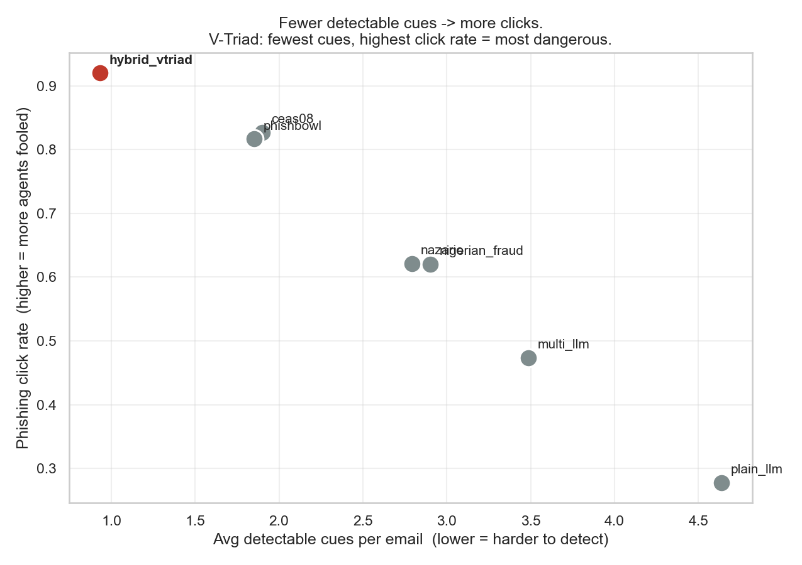
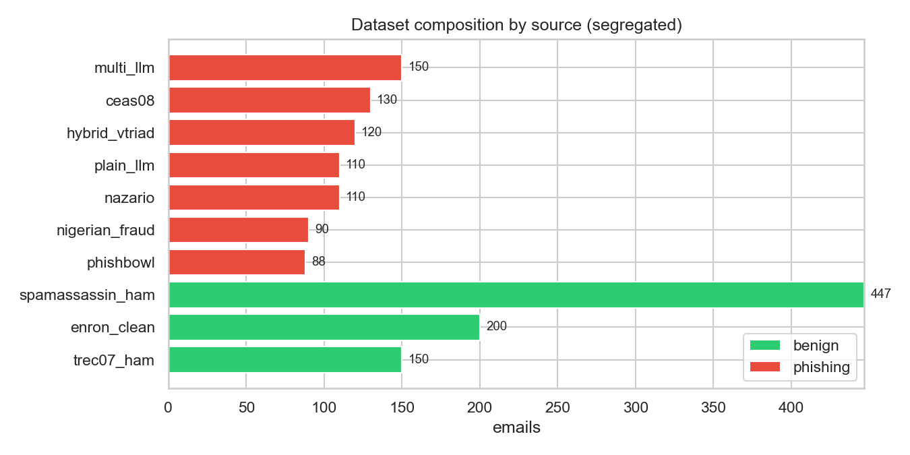

# AI Phishing Simulation via Hybrid Agent-Based Modeling

PES University Capstone · Project ID `PW26_SVM_01`
Adithya Kallaje · B. Thanav Reddy · Dattatreya K A · Krishna Venkatesh — guide: Dr. Sapna V M

An agent-based simulation of **how an employee's cognitive state — fatigue, motivation, vigilance — changes whether they fall for a phishing email**, and whether AI-crafted phishing evades human detection better than real, human-authored phishing. Live phishing tests on staff are unethical and illegal, so we simulate synthetic employees reading a labelled corpus.

---

## The headline result

**1,595 emails · 10 segregated sources · 239,250 decisions**
Cues extracted locally by `gemma4:12b` (Ollama) — one model across the whole corpus.

| Source | avg detectable cues | click rate | |
|---|---:|---:|---|
| **hybrid_vtriad** (AI, V-Triad-guided) | **0.93** | **92.0%** | ← fewest cues, **most clicks** |
| phishbowl (real phishing) | 1.85 | 81.7% | |
| ceas08 (real phishing) | 1.90 | 82.7% | |
| nazario (real phishing) | 2.79 | 62.1% | |
| nigerian_fraud (real 419) | 2.90 | 62.0% | |
| multi_llm (modern AI, 3 models) | 3.49 | 47.4% | |
| plain_llm (naive AI) | 4.64 | 27.8% | most cues, fewest clicks |

- **Spearman(cues, click rate) = −0.96** — near-monotonic: every step up in detectability is a step down in clicks.
- **Replicated across two independent extractors.** `llama-4-scout-17b` (hosted, 17B) and
  `gemma4:12b` (local, 12B) rank V-Triad **lowest in cues and highest in clicks** in both
  runs. The finding is not an artifact of one extraction model.
- **Benign false-positive rate: 0.12%** (benign cue sparsity 0.03–0.12 across all 3 benign sources)
- **Workday fatigue effect: +13.6%** (same agent, 4pm vs 8am)



**Interpretation:** persuasion-guided AI phishing carries barely more detectable red flags than *legitimate* email (0.93 vs ~0.03–0.12 for benign) — and it beats real, human-authored phishing at getting clicked. Sophistication is inversely related to detectability.



> **Reproducing:** cue counts are only comparable within one extractor, so the cache is scoped
> per model (`data/cue_cache_v2/<model>/`). Numbers above are the `gemma4:12b` run; the scout
> run is preserved under `groq-scout/`. Never mix the two in one corpus.

See **[`notebooks/06_agent_simulation_v2.ipynb`](notebooks/06_agent_simulation_v2.ipynb)** for the full analysis.

---

## Quick start

```bash
python -m venv .venv && .venv\Scripts\activate        # Windows
pip install -r requirements.txt

jupyter notebook notebooks/06_agent_simulation_v2.ipynb
```

> **Install from `requirements.txt`, not an ad-hoc `pip install` list.** `huggingface_hub`
> and `pyarrow` gate the `enron_clean` benign source, which fails *silently* — without both,
> the corpus builds as 1,395 instead of 1,595 and every number shifts, with nothing looking
> broken. Verify before trusting results:
> ```bash
> python -c "import pandas, numpy, matplotlib, seaborn, dotenv, huggingface_hub, pyarrow"
> ```

`06` runs top-to-bottom with **no API key and no local model** — cue extractions are cached in `data/cue_cache_v2/`. Safe to run live in front of an audience.

To rebuild the corpus / re-simulate:

```bash
python run_demo.py                 # build corpus → extract locally (cache-first) → simulate → report
python run_demo.py --extractor groq  # hosted extraction instead (needs GROQ_API_KEY; rate-limited)
python run_demo.py --generate 120  # also generate 120 more of each synthetic class (needs GROQ_API_KEY)
python run_demo.py --charts        # also write presentation charts
```

Extraction defaults to **local Ollama** (`gemma4:12b`) — no key needed, and it is the
reproducible path used for the published numbers. `.env` keys are only for the optional
hosted path: `GROQ_API_KEY` (generation, and `--extractor groq`), `KAGGLE_USERNAME` /
`KAGGLE_KEY` (corpus download).

---

## Two generations of the model

Both live in the repo side by side — **v1 is untouched and still runs.**

| | **v1** (`05_agent_simulation.ipynb`) | **v2** (`06_agent_simulation_v2.ipynb`) |
|---|---|---|
| Model | `src/agent.py` | `src/agent_v2.py` |
| Emails | 250, 4 sources | **1,595, 10 segregated sources** |
| Fatigue | KSS circadian + static ED | **dynamic ED, circadian dropped, noisy-OR** |
| Job performance | 2 stacked regressions | **weighted geometric mean** |
| FPL | fatigue × (1−JP) | + **Perceived Vulnerability** |
| Threshold | fixed 2–6 | **partly dynamic** (base + F_dynamic drift) |
| Agents | independent traits | **copula-correlated** |
| Workday curve | **flat / slightly falling** | **rises (+13.6%)** |
| Decisions | 37,500 | **239,250** |

**Why v2 exists:** in v1, click rate correlated **+0.98 with the fixed suspicion threshold** but only **−0.06 with fatigue** (and −0.05 with FPL — the wrong sign). The Åkerstedt circadian term peaks at 4:48pm, making agents *more* alert late in the day, cancelling fatigue accumulation and flattening the workday curve. v2 rebuilds the model on a single `[0,1]` scale so fatigue is monotone and actually moves outcomes.

---

## How it works

```
raw sources → normalise + clean + dedupe → master_emails_v2.csv (segregated by `source`)
           → cue extraction (9 cues, cache-first) → data/cue_cache_v2/
           → agents (copula-correlated traits) × 5 workday hours × emails
           → per-cue stochastic decision loop → clicked | reported
           → data/simulation_results_v2.csv → notebook 06
```

**The v2 cognitive chain** (all quantities in `[0,1]`):

```
ED(t)        = dynamic energy depletion (workload, time-pressure, task-switching, job complexity)
F_dynamic   += dt · (ED − Recovery)              accumulates across the day
TotalFatigue = noisy-OR(F_base(sleep), F_dynamic)
JP           = (1−Fatigue)^0.5 · Motivation^0.3 · RoleClarity^0.2
FPL          = TotalFatigue · (1−JP) · (1 − λ·PerceivedVulnerability)
cue_fpl      = FPL · (1 − CueStrength[cue]) + trait modifiers
decision     : perceive cues until suspicion ≥ threshold → reported, else clicked
```

The **decision** comes from the per-cue Bernoulli loop. `P_click` (a centred sigmoid) is a reporting index only.

### The 9 phishing cues

`urgency` · `threats` · `generic_greeting` · `spelling_grammar` · `emotional_appeal` · `too_good_true` · `personal_info` · `suspicious_sender` · `suspicious_link`

Extracted once per email by an LLM and cached to disk. Each cue has a **CueStrength** (0.4–0.8) — blatant cues are hard to miss, subtle ones easy to skim past.

---

## The dataset

**1,595 emails, 10 sources, kept strictly segregated** (never blended) so cue behaviour and click rate can always be sliced per origin.

| Class | Count | Sources |
|---|---:|---|
| Benign | **797** | SpamAssassin ham (447) · Enron pre-cleaned (200) · TREC-07 (150) |
| Real phishing | **418** | CEAS-08 (130) · Nazario (110) · Nigerian/419 (90) · Cornell Phishbowl (88) |
| Synthetic phishing | **380** | multi_llm (150, 3 models) · hybrid_vtriad (120, V-Triad-guided) · plain_llm (110, naive) |

Every source's **origin, licence, retrieval date, cleaning steps and the models that processed it** are auto-documented in **[`DATA_PROVENANCE.md`](DATA_PROVENANCE.md)** — regenerated from the actual data, so it cannot drift out of sync.

Sources marked ⚠️ have inherited/unclear licences: **verify before publishing, and cite the original corpora, not the Kaggle mirrors.** We ship **loader code + DOIs, not re-hosted corpora** — `src/dataset_v2.py` reconstructs the dataset from the original sources.

> **Data-quality note:** the Cornell Phishbowl records wrap each real phish in Cornell IT's *warning* boilerplate ("This phish typically originates from… Do not reply…"). v1 fed that anti-phishing language straight into cue extraction; `dataset_v2.clean_phishbowl()` strips it.

---

## Repo structure

```
notebooks/
  02_pattern_testing.ipynb        cue regex development
  03_audit_synthetic_vs_real.ipynb  dataset quality audit
  04/05_agent_simulation.ipynb    v1 simulation (untouched)
  06_agent_simulation_v2.ipynb    v2 — THE analysis: dataset, model, results, robustness
src/
  agent.py            v1 cognitive model
  agent_v2.py         v2 model + copula agent generation + simulation runner
  decision_loop.py    per-cue stochastic click/report loop (shared by v1 & v2)
  simulation.py       v1 pipeline orchestration
  dataset_v2.py       corpus assembly: clean, parse, dedupe, segregate
  groq_client.py      Groq cue extraction (batched) + synthetic generation
  provenance.py       auto-generates DATA_PROVENANCE.md + composition chart
  ollama_extractor.py / cue_extractor.py / regex_extractor.py   extraction backends
run_demo.py           single entry point: build → extract → simulate → report
ARCHITECTURE.md       onboarding map of the v1 baseline
DATA_PROVENANCE.md    auto-generated dataset datasheet
SYSTEM.md             technical codebase reference
```

---

## Honest limits

- **Coefficients are modeling choices.** ED weights, JP exponents, `λ_PV`, threshold drift and the P_click centring were tuned for `[0,1]` bounds and monotonicity — **not** taken from any paper. The literature motivates *structure and signs* only.
- **The extraction model matters.** Cue counts differ measurably by model (llama-3.1-8b over-flags benign at ~1.7 cues/email vs ~0.0 for the models we use), so a corpus must be extracted by **one** model — the cue cache is scoped per model for exactly this reason. Results here use **local `gemma4:12b`**, recorded in the datasheet. The V-Triad ranking **replicates** on `llama-4-scout-17b` (Groq), so the headline is not an artifact of one extractor, but cue *magnitudes* are not comparable across extractors.
- **The Shin-Carley `−5.584` PV coefficient** comes from the Phase-1 report and must be verified against the primary paper. The organizational damage index is an *index*, not validation — it's built from its own inputs, and tracks actual clicks at only r ≈ +0.08.
- **The suspicion threshold still dominates between agents** (r ≈ 0.98). It's a large individual difference; fatigue is a *within-person* effect. Both are reported honestly in `06 §12`.
- **Synthetic phishing is self-generated** (fictional entities only) — no public V-Triad corpus exists.
- The v1-vs-v2 workday chart changes **model *and* dataset**; the within-agent measure is the clean evidence.
